# DATASCI 217 Final Project
## Michelle Li

## Question 1: Data Preparation with Command-Line Tools
I prepared a shell script `prepare.sh` which runs the script `generate_dirty_data.py` to generate our csv file (`ms_data_dirty.csv`). After generating the raw data, the shell script then automatically cleans the data (removing empty lines, comment lines, and extra commas; ensures walking speed is between 2.0-8.0 feet/second) and extracts the necessary columns (patient_id, visit_date, age, education_level, walking_speed). The shell script then generates a file `insurance.lst` which contains labels for an insurance_type variable (Bronze, Silver, and Gold tiers). The summary is then outputted and is as follows:

Total number of visits: 13816
First 5 records:
| patient_id | visit_date | age   | education_level | walking_speed |
| ---------- | ---------- | ----- | --------------- | ------------- |
| P0001      | 2020-03-16 | 62.21 | Bachelors       | 3.53          |
| P0001      | 2020-06-18 | 62.47 | Bachelors       | 2.92          |
| P0001      | 2020-09-20 | 62.73 | Bachelors       | 3.37          |
| P0001      | 2020-12-12 | 62.96 | Bachelors       | 3.58          | 
| P0001      | 2021-03-20 | 63.23 | Bachelors       | 3.51          | 

## Question 2: Data Analysis with Python
The `analyze_visits.py` file cleans and structures the data, adds randomly assigned insurance information (insurance type and the associated visit costs), and calculates summary statistics.

One summary statistic to look at is the mean walking speed stratified by education level:
| education_level | walking_speed |
| --------------- | ------------- |
| Bachelors       | 4.064174      |
| Graduate        | 4.497175      |
| High School     | 3.210073      |
| Some College    | 3.594828      |
We can see that those with only a high school level education have the lowest mean walking speed.

Another summary statistic generated is the mean cost stratified by insurance type:
| insurance_type | visit_cost |
| -------------- | ---------- |
| Bronze         | 99.962930  |
| Gold           | 300.443441 |
| Silver         | 200.340372 |
We can see that the Gold tier has the highest visit cost, followed by Silver, then Bronze.

The last summary statistic generated is the correlation between age and walking speed, using the `corr()` function. This resulted in a value of -0.71, which suggests that for every age increase in year, the walking speed decreases by 0.71.

## Question 3: Statistical Analysis
### Analyzing walking speed
A multiple regression model (OLS) was generated for walking speed using `walking_speed ~ education_level + age`:
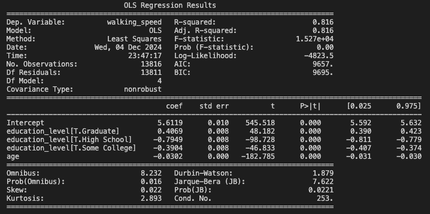

We can see that the model gave an R-squared value of 0.816, which means that about 81.6% of the variance in walking speed was captured by the defined predictors (education_level and age). Our F-statistic is very low (below 0.05) which suggests strong statistical significance. Looking at the predictors, we can see that all of them are statistically significant.

### Analyzing costs
Simple summary statistics for visit costs (min, mean, median, max, standard deviation) were generated for each insurance tier as well as the effect size estimate (eta squared):
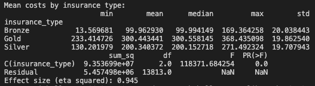

A boxplot was created as a visualization:
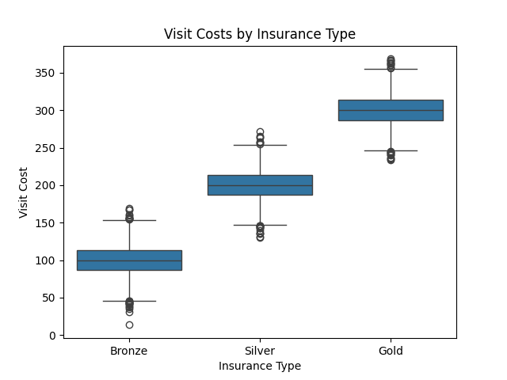

We can see that all basic summary statistics of visit cost increase with insurance tier level, which is further emphasized by the boxplot visualization. Our effect size estimate of 0.945 (eta squared) indicates that 94.5% of the variance in visit cost is captured by our model (or by insurance type), suggesting a very strong effect.

### Advanced analysis
To look at the interaction effects of education and age on walking speed, I generated a mixed linear regression model: `walking_speed ~ C(education_level) * age + insurance_type`. The results are as follows:
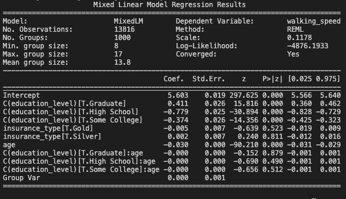

Looking at the p-values, we can see that education level and age do have an effect on walking speed as they are all below 0.05. Taking a closer look at the coefficients, we can also see that a high school and some college level of education have a negative effect on walking speed (-0.779 and -0.374, respectively). The age coefficient is -0.030, suggesting that there is also somewhat of a negative effect on walking speed. However, when looking at the confounders/interactions, these do not seem statistically significant when stratified across education levels as their p-values are greater than 0.05.

## Question 4: Data Visualization
Visualizations were created in a Jupyter notebook with the aid of seaborn and pyplot packages.

### Walking speed analysis
The scatter plot of age vs walking speed with a regression line shows how walkign speed decreases with age:
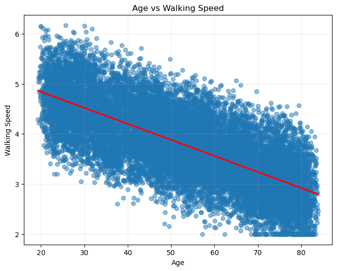

A boxplot of education level and walking speed shows that walking speed increases with education level (high school, some college, bachelors, graduate):
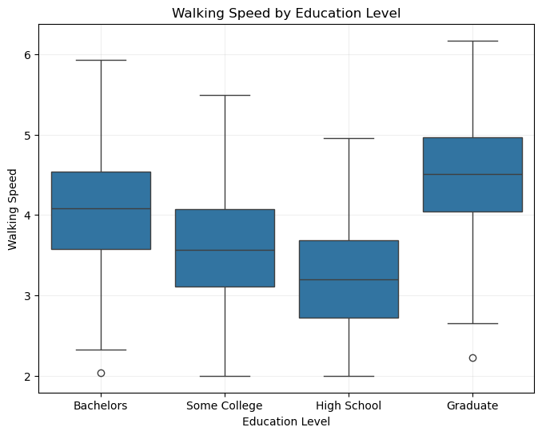

A lineplot of education level + age interaction reinforces the findings as depicted from the boxplot previously mentioned:
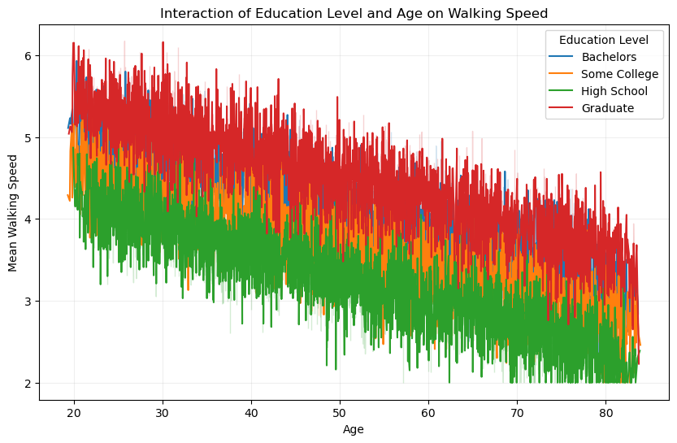

### Cost analysis
A barplot plot of mean costs by insurance type shows how visit costs increase with insurance tier level:
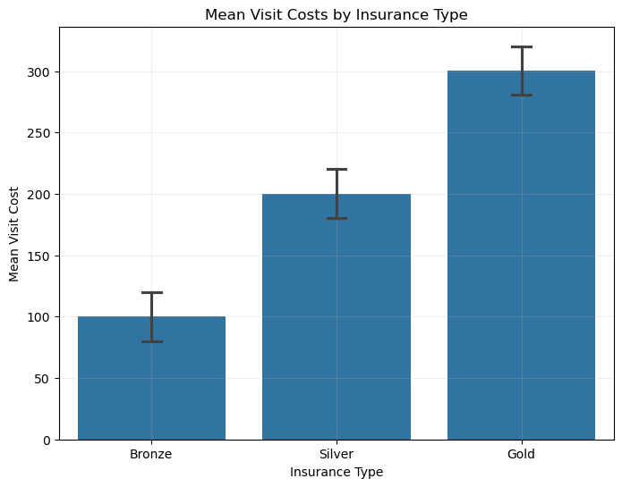

Which is also further reemphasized with a boxplot:
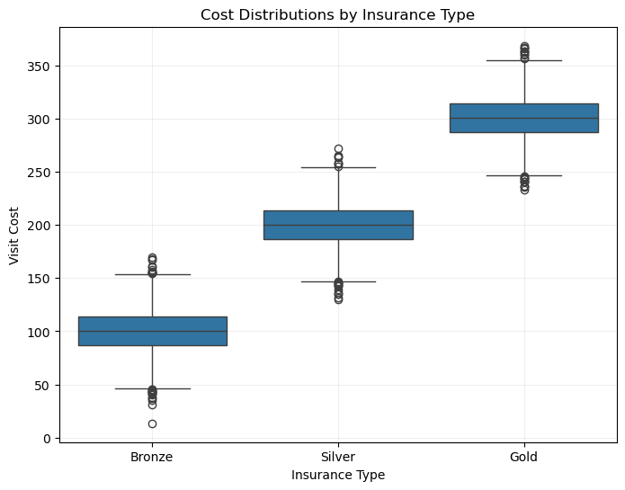

### Combined visualizations
A pairplot shows visualizations of age, walking_speed, and visit_cost stratified by insurance_type, which shows a negative trend when comparing age and walking_speed. We can also see again that visit costs increase with insurance tiers:
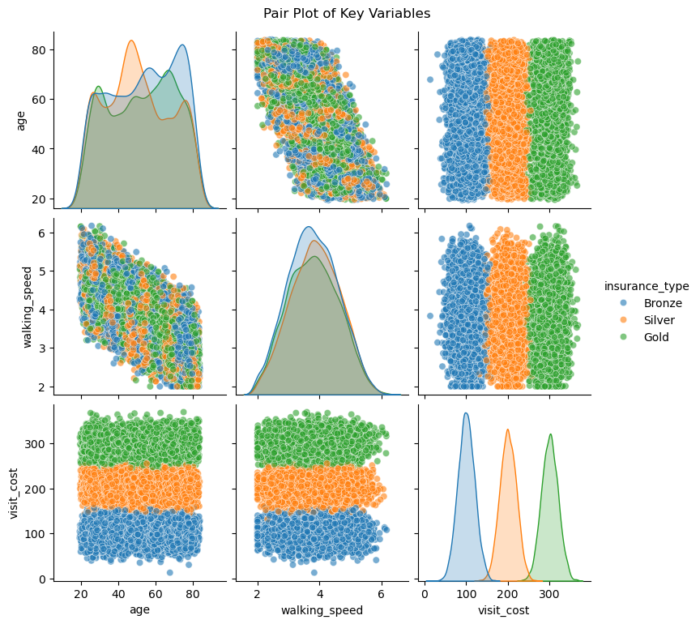

A facet grid of age, walking speed, and education level, stratified by insurance type, again shows that there is a negative trend with age and walking speed as well as a positive trend with increasing visit costs and insurance tier:
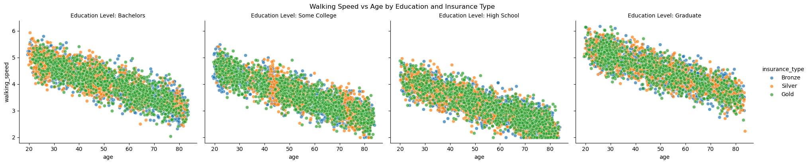

Another facet grid of visit cost, visit date, and insurance type show do not seem to show any noticeable trends with increasing visit costs and date of visit:
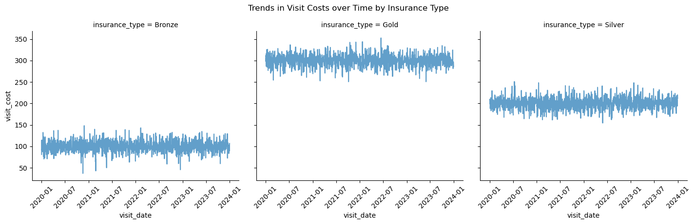

